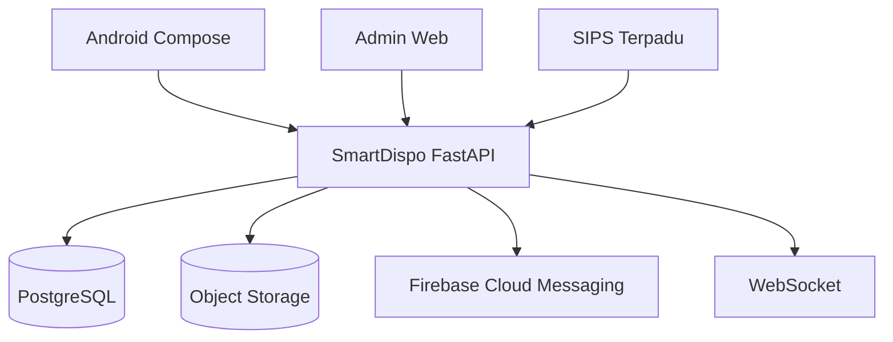

# Arsitektur SmartDispo DPRD

## Batas sistem

Android, panel administrator, dan SIPS Terpadu tidak mengakses PostgreSQL secara langsung. Seluruh operasi melewati FastAPI agar permission, workflow, versioning, audit, dan validasi konkurensi konsisten.

## Aturan domain

- Workflow definitions memakai versi DRAFT, PUBLISHED, dan RETIRED.
- Dokumen yang sedang berjalan tetap memakai workflow version saat instance dibuat.
- Aksi tersedia berasal dari task backend, bukan role yang di-hard-code di APK.
- ADMIN mengelola konfigurasi tetapi tidak otomatis memiliki kewenangan pejabat.
- Perubahan substantif menghasilkan `document_versions` baru dan hash SHA-256 baru.
- Approval mengikat `document_id`, nomor versi, hash, pengguna, role, perangkat, IP, dan waktu.
- SIGN, VERIFY, COORDINATE, APPROVE, dan DISPOSITION wajib online.
- `lock_version` menghasilkan HTTP 409 saat dua pengguna bertindak pada state yang sudah berubah.

## Struktur repository

- `backend/`: API, model domain, migration, dan tests.
- `android/`: aplikasi Kotlin/Jetpack Compose.
- `admin-web/`: panel konfigurasi administrator.
- `templates/`: source of truth template administrasi.
- `.github/workflows/`: validasi backend, web, dan APK.
